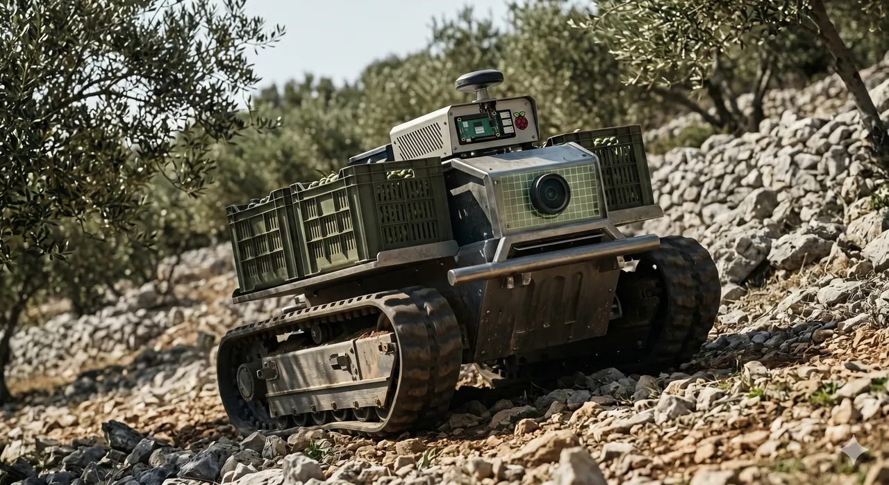

The recently published fourth report of the European Commission on the state of the Digital Decade, covered in detail by [Lider Media](https://lidermedia.hr/biznis-i-politika/digitalno-desetljece-imamo-jake-resurse-ali-mali-biznisi-zaostaju-157777), brought sobering data for Croatia. Even though we have a good basic infrastructure, our small and medium enterprises – which include serious agricultural producers and family farms (OPGs) – are dangerously lagging behind in adopting new technologies.

We often encounter a misconception of what digitalization means. For many, it still just means creating a generic WordPress site. However, digitalization that brings real competitiveness and increases productivity is not a digital "business card" – it is the integration of technology into the very process of production and sales.

At [OleaD](/en/about-project/), we approach technology through the lens of solving concrete problems in the field. While reports deal with the lack of skills and poor integration in rural areas, we offer solutions tailored precisely for such demanding conditions:

### 1. Signal issues in the olive grove? The solution: "Offline-First" architecture

The report rightly points out that rural and island areas are lagging behind with network coverage. A farmer cannot depend on whether the app will crash in the middle of the olive grove. That is why we develop advanced solutions using *Next.js* and *Django* with built-in **"Offline-First"** logic. Our systems are designed to run seamlessly even in locations without any mobile signal, synchronizing data only when the device reconnects.

### 2. Proving premium quality: The Olea Digitalis system

One of the key EU requirements is using technology for ecological goals and the green transition. Our main product, **Olea Digitalis**, enables complete digital traceability of olive oil – from tree to bottle. By utilizing *Algorand blockchain* technology (including ASA NFTs), each of our premium olive growers receives irrefutable proof of the origin and quality of their product. This is not administrative red tape; it is tangible added value on the market.

### 3. Physical labor and technology: Meet OleaDbot

Lack of labor and hard physical conditions are real problems. Software by itself cannot carry crates. That is why we are developing **OleaDbot**. This is not a toy, but an IoT assistant in the olive grove designed to take the load, carry batteries for harvesting equipment, and help with the hardest work in the field. Technology must serve humans where it is toughest.

At OleaD, we are guided by the Stoic principle – **Acta non verba** (Deeds, not words). It is time to stop talking about digitalization as an abstract concept and start using it as a tool that saves time, money, and backs for olive growers and small business owners in Dalmatia.

Do you want to see what a real digital transformation tailored to your family farm (OPG) looks like? [Get in touch with us for collaboration.](/en/#kontakt)
